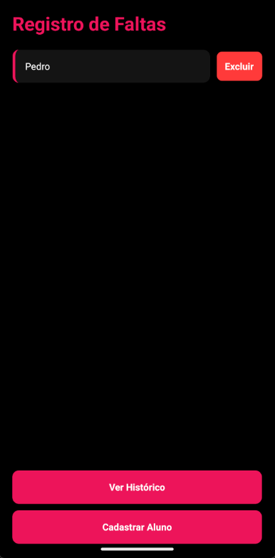
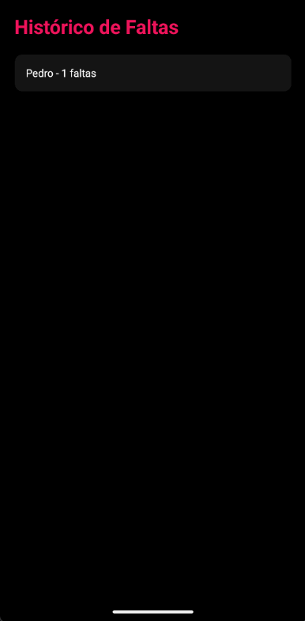
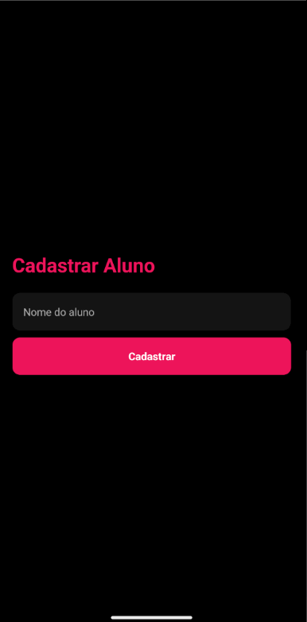

```md
# Registro de Faltas - FIAP

## a) Sobre o Projeto

O Registro de Faltas é um aplicativo mobile desenvolvido com React Native e Expo que permite gerenciar a presença de alunos de forma simples e eficiente.

O objetivo do app é substituir o controle manual de faltas, oferecendo uma solução digital para registro, consulta e persistência de dados.

### Operação escolhida
A operação escolhida foi a gestão acadêmica, pois o controle de presença é essencial no acompanhamento de alunos e no ambiente educacional.

### Funcionalidades implementadas
- Listagem de alunos
- Cadastro de novos alunos
- Registro de faltas por aluno
- Visualização do histórico de faltas
- Exclusão de alunos
- Persistência de dados com AsyncStorage
- Navegação entre telas com Expo Router
- Interface estilizada com tema escuro

---

## b) Integrantes do Grupo

- Pedro Mitsuo Risardi Nisiaymamoto  

---

## c) Como Rodar o Projeto

### Pré-requisitos
- Node.js instalado
- Expo CLI (via npx)
- Android Studio (emulador) ou celular com Expo Go

### Passo a passo

git clone https://github.com/Mitsuo100/fiap-cpad-cp1-faltas-app.git  
cd fiap-cpad-cp1-faltas-app  
npm install  
npx expo start -c  

Para abrir no Android:
- Pressione "a" no terminal  
ou  
npx expo start --android  

---

## d) Demonstração

### Prints das telas

#### Tela Inicial


#### Histórico


#### Cadastro


### Registro


### Vídeo


---

## e) Decisões Técnicas

### Estrutura do projeto
- app/ → telas
- data/ → dados e AsyncStorage
- components/ → componentes reutilizáveis

### Hooks utilizados
- useState
- useEffect

### Persistência de dados
AsyncStorage foi usado para salvar alunos e faltas.

### Exclusão de alunos
Foi adicionada remoção com atualização automática da lista.

---

## f) Próximos Passos

- Evitar duplicados
- Melhor UI
- Animações
- Gráficos de faltas
- Confirmação ao excluir

---

## Status do Projeto

Funcional e pronto para avaliação.
```